<!-- Profile README for @zuyu-ultra -->

  

  
  
  

  <code>ISSUE #001 / ZUYU</code>&nbsp;&nbsp;•&nbsp;&nbsp;<code>WANG ZHUYU</code>&nbsp;&nbsp;•&nbsp;&nbsp;<code>BUILD · LEARN · SHIP</code>

<table>
  <tr>
    <td width="56%" valign="top">
      <h3>01 — ORIGIN STORY</h3>
      

        Hi, I'm <strong>zuyu</strong> — <strong>Wang Zhuyu</strong>. I turn loose ideas into practical software. My current work lives around thoughtful web tooling, developer experience, and small utilities that make complex information easier to see and act on.
      

      

        I care about calm interfaces, local-first workflows, and automation that remains reviewable by the person using it.
      

    </td>
    <td width="44%" valign="top">
      <h3>02 — NOW PLAYING</h3>
      

        <code>[ ON PANEL ]</code> <a href="https://github.com/zuyu-ultra/github-contribution-graph-generator">Contribution Graph Generator</a> 
        <code>[ TRAINING ]</code> TypeScript · React · Vite 
        <code>[ BUILDING ]</code> Web tools with clear, inspectable outputs 
        <code>[ WEB PORTAL ]</code> <a href="https://zhuyu.wang">enter zhuyu.wang ↗</a> 
        <code>[ BACK ISSUES ]</code> Java and JavaScript experiments
      

    </td>
  </tr>
</table>

---

### 03 — POWER SET

  
  
  
  
  
  
  

<table>
  <tr>
    <td width="33%" valign="top">
      INTERFACE 
      <strong>Interaction, clarity, visual systems</strong> 
      <code>React</code> <code>Vite</code> <code>CSS</code>
    </td>
    <td width="33%" valign="top">
      LOGIC 
      <strong>Typed tools and programmable workflows</strong> 
      <code>TypeScript</code> <code>JavaScript</code> <code>Java</code>
    </td>
    <td width="33%" valign="top">
      DELIVERY 
      <strong>Readable code, reviewable automation</strong> 
      <code>Git</code> <code>GitHub</code> <code>Actions</code>
    </td>
  </tr>
</table>

---

### 04 — CASE FILES

<table>
  <tr>
    <td width="50%" valign="top">
      <a href="https://github.com/zuyu-ultra/github-contribution-graph-generator"><strong>CASE 01 / GitHub Contribution Graph Generator ↗</strong></a> 
      A browser-based, local-first tool for designing a GitHub contribution heatmap and producing a reviewable Bash script. No credentials, tokens, or image data leave the browser.  
      <code>TypeScript</code> <code>React</code> <code>Vite</code>
    </td>
    <td width="50%" valign="top">
      <a href="https://github.com/zuyu-ultra/Epoch"><strong>CASE 02 / Epoch ↗</strong></a> 
      A Java and Gradle multi-module codebase, with separated core, authentication, and actuator services for exploring application structure.  
      <code>Java</code> <code>Gradle</code> <code>Services</code>
    </td>
  </tr>
  <tr>
    <td width="50%" valign="top">
      <a href="https://github.com/zuyu-ultra/map-calculate"><strong>CASE 03 / Map Calculate ↗</strong></a> 
      A compact utility for working with China location information and calculations.  
      <code>Utility</code> <code>Location data</code>
    </td>
    <td width="50%" valign="top">
      <a href="https://github.com/zuyu-ultra?tab=repositories"><strong>CASE 04 / Repository Index ↗</strong></a> 
      Experiments, learning notes, web work, and small tools — each one a record of an idea made concrete.  
      <code>Explore all work</code>
    </td>
  </tr>
</table>

---

### 05 — THE CODE I BUILD BY

<table>
  <tr>
    <td width="33%" valign="top">
      RULE 01 / LOCAL BY DEFAULT 
      <strong>Keep control close.</strong> 
      Useful tools should not require giving away more data than the task needs.
    </td>
    <td width="33%" valign="top">
      RULE 02 / MAKE IT LEGIBLE 
      <strong>Complexity deserves a clear surface.</strong> 
      Interfaces and automation should explain themselves before they ask for trust.
    </td>
    <td width="33%" valign="top">
      RULE 03 / SHIP THE SIGNAL 
      <strong>Small releases compound.</strong> 
      Learning becomes more valuable when it is turned into something usable.
    </td>
  </tr>
</table>

---

### 06 — SCOREBOARD

  
  
  

  

### 07 — ACTION TRAIL

  <picture>
    <source media="(prefers-color-scheme: dark)" srcset="https://raw.githubusercontent.com/zuyu-ultra/zuyu-ultra/output/github-contribution-grid-snake-dark.svg" />
    <source media="(prefers-color-scheme: light)" srcset="https://raw.githubusercontent.com/zuyu-ultra/zuyu-ultra/output/github-contribution-grid-snake.svg" />
    
  </picture>

  <a href="https://zhuyu.wang"><code>CONTINUE THE STORY AT ZHUYU.WANG →</code></a> · Building useful things, one considered commit at a time.

